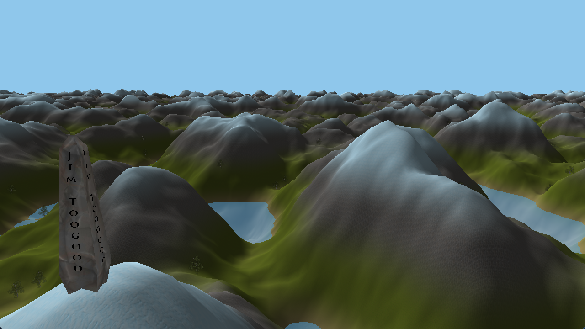
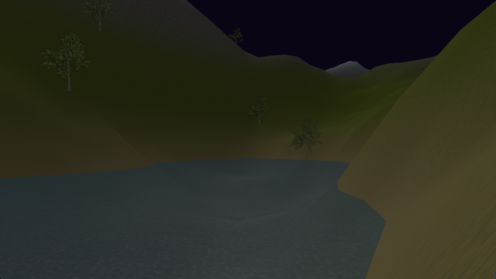
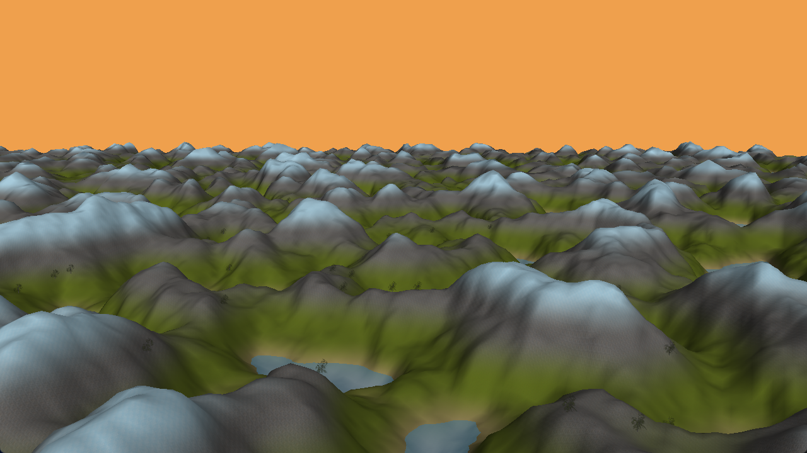
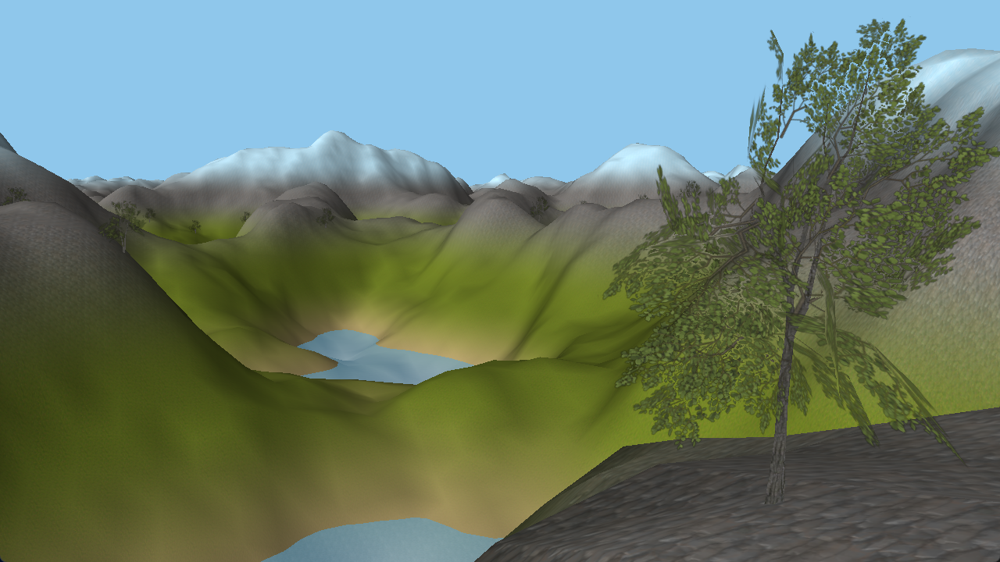

## Procedural 3D Terrain Generator - 70% Coursework for the Comp3016 Immersive Game Technologies Module in C++ SDL, by Jim Toogood  

---

## Assets  
All textures and models used in this project are copyright-free and licensed for free use. All rights remain with their respective creators as listed below. This project does not claim ownership of any of the third-party assets cited.  

**Models Used:**  
Tree - https://www.turbosquid.com/3d-models/shapespark-low-poly-exterior-plants-kit-1826978   

**Texture Assets Used:**  
water.jpg - https://www.manytextures.com/texture/44/clear-sea-water/  
grass.jpg - https://www.poliigon.com/texture/flat-grass-texture/4585  
sand.jpg - https://www.poliigon.com/texture/rippled-wet-sand-texture/6997  
snow.jpg - https://freestylized.com/material/snow_01/  
rock.jpg - https://freestylized.com/material/cliff_rocks_01/  

---

## How to run game EXE
1) Download repo  
2) Go to folder `Comp3016-70-CW-main/Comp3016_70CW/Comp3016_70CW/`  
3) Ensure following file structure exists there:  
```text
Comp3016_70CW/  
 ├── Comp3016_70CW.exe  
 ├── assimp-vc143-mt.dll  
 ├── media/  
 │    ├── grass.jpg  
 │    ├── grass_normal.jpg  
 │    ├── rock.jpg  
 │    ├── rock_normal.jpg  
 │    ├── sand.jpg  
 │    ├── sand_normal.jpg  
 │    ├── snow.jpg  
 │    ├── snow_normal.jpg  
 │    ├── water.jpg  
 │    ├── signature/  
 │    │    ├── signature.jpg  
 │    │    ├── signature.mtl  
 │    │    └── signature.obj  
 │    ├── tree/  
 │    │    ├── bark.jpg  
 │    │    ├── branch-01.png  
 │    │    ├── branch-02.png  
 │    │    ├── tree.mtl  
 │    └──  └── tree.obj  
 ├── shaders/  
 │    ├── fragmentShader.frag  
 │    ├── vertexShader.vert  
 │    ├── waterFragmentShader.frag  
 │    ├── waterVertexShader.vert  
 │    ├── modelFragmentShader.frag  
 │    └── modelVertexShader.vert  
 └── (any additional folders/files are unrelated to running the .exe)  
```
4) Open `Comp3016_70CW.exe` and that's it!  

*Note: If you want to build a new .exe file from inside Visual Studio, it will be built to `Comp3016_70CW/x64/Debug/`. Attempting to run the .exe file from this folder will not work, the .exe must be moved to the folder show above in order to run correctly.*

---

## How to run Visual Studio Project
1) Download repo 
2) Ensure you have [Assimp](https://github.com/assimp/assimp) downloaded, installed and importantly **binaries built** at `C:/Users/Public/Assimp`
3) Open file `Comp3016-70-CW-main/Comp3016_70CW/Comp3016_70CW.sln` and that's it!  

*Note: Usually the 3 above steps are enough but depending on your system, you may need to replace `Comp3016-70-CW-main/Comp3016_70CW/Comp3016_70CW/assimp-vc143-mt.dll` and `Comp3016-70-CW-main/Comp3016_70CW/Comp3016_70CW/assimp-vc143-mt.lib` with the ones from your version of Assimp found at `C:/Users/Public/Assimp/binaries`*  

---

## Youtube link
https://youtu.be/qollNW6ae0Q  

---

## Gameplay description
This project is a real-time 3D procedural terrain generator. When ran, the program will load into a 3D environment that can be explored via a free-cam *(see controls below)*. The player can travel in any direction for as long as they like and the terrain will continue dynamically generating around them, utilising a chunk-based terrain system with distance-based Level of Detail (LOD). The world consists of perlin-noise generated tall mountains and deep lakes, multiple blended normal-mapped terrain materials (grass, sand, rocks and snow), procedurally placed trees, animated water, a dynamic day/night cycle that affects skybox colour and scene lighting, and a stone obelisk with my name carved into it at the centre, serving as the projects signature.  

Controls (mouse & keyboard):  
- **Move Horizontally** left and right with `A` and `D`, forwards and backwards with `W` and `S`  
- **Move Vertically** up with `Space`, down with `LShift`  
- **Look Around** by moving the mouse  
- **Exit Program** with `Escape`  

---

## Dependencies used
- **[OpenGL4](https://www.opengl.org/)** - Core graphics API  
- **[GLFW](https://www.glfw.org/)** - Window creation and input handling  
- **[GLAD](https://glad.dav1d.de/)** - OpenGL function loader *(previous commits in this repo used [GLEW](https://glew.sourceforge.net/) instead)*  
- **[GLM](https://github.com/g-truc/glm)** - Mathematics library  
- **[Assimp](https://github.com/assimp/assimp)** - Obj model loading  
- **[stb_image](https://github.com/nothings/stb)** - Texture loading  
- **[LearnOpenGL Shaders & Models](https://github.com/JoeyDeVries/LearnOpenGL/)** - Loading and utilising of shaders & assimp models  

All required files and asset folders are included in this repo. No external installations are required to run the executable.  

---

## Use of AI description
ChatGPT (OpenAI GPT-5) was used during development for:  
- Help with suggesting ideas and potential features (for example suggesting the usage of caching for height calculation to improve performance)  
- Extensive debugging and code assist  
- Functional code testing  
- Repo and readme report formatting  

---

## Game programming patterns that I used
- **Chunk-based terrain loading** - Terrain divided into square chunks that load and unload dynamically  
- **Level of detail (LOD) rendering** - Terrain mesh resolution changes based on distance from the camera  
- **LOD skirting** - When chunks with different LODs are next to each other visible cracks in the terrain can often be seen. LOD skirting generates extra vertices below the edges of chunks to avoid this  
- **Normal mapping** - Terrain textures include normal maps to allow them to look better with the lighting system  
- **Texture blending** - Borders between terrain textures are smoothed out by blending the textures together gradually (calculated inside the fragmentShader)  
- **Separation of concerns & OOP** - Core systems divided into `Game`, `Camera` main classes, and various utility functions and structs  
- **Perlin-based procedural height generation** - Terrain height is calculated using perlin-noise maps to make terrain look natural and avoid repetition  
- **Delta time management** - Frame-independent time management used for consistent camera movement, day/night cycle and water animation, regardless of performance  
- **Height caching** - Perlin height values are cached after being calculated, and looked up using hash keys, in order to improve performance of chunk loading  

---

## Game mechanics and how they are coded
### Camera Movement
When controls are inputed, apply movement in the relevant direction. When mouse is moved, camera direction changes in relevant direction.  
```c++
// -=-=- Keyboard Controls -=-=-
// Horizontal movement controls
vec3 horizontalFront = normalize(vec3(front.x, 0.0f, front.z));
if (glfwGetKey(window, GLFW_KEY_W) == GLFW_PRESS)
    position += speed * horizontalFront;
if (glfwGetKey(window, GLFW_KEY_S) == GLFW_PRESS)
    position -= speed * horizontalFront;
if (glfwGetKey(window, GLFW_KEY_A) == GLFW_PRESS)
    position -= normalize(cross(horizontalFront, up)) * speed;
if (glfwGetKey(window, GLFW_KEY_D) == GLFW_PRESS)
    position += normalize(cross(horizontalFront, up)) * speed;

// Vertical movement controls
if (glfwGetKey(window, GLFW_KEY_SPACE) == GLFW_PRESS)
    position += speed * up;
if (glfwGetKey(window, GLFW_KEY_LEFT_SHIFT) == GLFW_PRESS)
    position -= speed * up;

// -=-=- Mouse Controls -=-=-
float xOffset = (float)xpos - lastXPos;
float yOffset = lastYPos - (float)ypos;
lastXPos = (float)xpos;
lastYPos = (float)ypos;

// Define mouse sensitivity
const float sensitivity = 0.04f;
xOffset *= sensitivity;
yOffset *= sensitivity;

yaw += xOffset;
pitch += yOffset;

// Clamp pitch to avoid turning up & down beyond 90 degrees
pitch = clamp(pitch, -89.0f, 89.0f);

// Calculate camera direction
vec3 direction = vec3(
    cos(radians(yaw)) * cos(radians(pitch)),
    sin(radians(pitch)),
    sin(radians(yaw)) * cos(radians(pitch))
);
front = normalize(direction);
```

### Chunk-based LOD System
Each chunk is assigned a LOD based on its distance from the camera.  
```c++
static int CalculateLOD(int x, int z) {
    // Calculate distance from player
    int distance = std::max(abs(x), abs(z));

    // Lower LOD values = higher level of detail (0 = max detail)
    if (distance <= 1) { return 0; }
    if (distance <= 2) { return 1; }
    else { return 2; }
}
```

### Procedural Height Generation
Terrain height is generated using GLM perlin noise.  
```c++
float GenerateHeight(float x, float z) {
    float baseFrequency = 0.02f;    // Higher value = More hills
    float baseAmplitude = 25.0f;    // Higher value = Bigger hills

    float height = 0.0f;        // Accumlated height
    float persistence = 0.35f;  // Amplitude scaling for each octave
    int octaves = 6;            // Higher value = more terrain detail

    for (int i = 0; i < octaves; i++) {
        // Frequency increases per octave
        float frequency = baseFrequency * (float)pow(2.0f, i);

        // Amplitude decreases per octave
        float amplitude = baseAmplitude * (float)pow(persistence, i);

        // Use glm to generate perlin noise and multiply by amplitude
        height += perlin(vec2(x * frequency, z * frequency)) * amplitude;
    }

    return height;
}
```

### Day/Night Cycle
Time cycles between day and night affecting skybox colour and scene lighting, with sunset and sunrise transitions.  
```c++
// Calculate delta time
float currentFrame = (float)glfwGetTime();
deltaTime = currentFrame - lastFrame;
lastFrame = currentFrame;

// Advance day/night cycle
timeOfDay += deltaTime / dayLength;
if (timeOfDay > 1.0f) {
    timeOfDay = 0.0f;
}

// Define skybox colours
const vec3 dayColour = vec3(0.56f, 0.78f, 0.92f);
const vec3 twilightColour = vec3(1.0f, 0.6f, 0.2f);
const vec3 nightColour = vec3(0.04f, 0.02f, 0.08f);

// Night
if (timeOfDay < 0.4f) {
    lightColour = nightColour;
    lightIntensity = 0.3f;
}
// Sunrise
else if (timeOfDay < 0.45f) {
    float t = (timeOfDay - 0.4f) / 0.05f;
    lightColour = mix(nightColour, twilightColour, t);
    lightIntensity = mix(0.3f, 0.65f, t);
}
else if (timeOfDay < 0.5f) {

//etc.
```


### Height caching
Perlin height values are cached after being calculated. Hash keys are used to look up cached values to avoid having to re-calculate perlin values. This drastically improves chunk loading performance, giving the player a smoother experience.  
```c++
float GetCachedHeight(unordered_map<int64_t, float>& heightCache, float x, float z) {
    int ix = (int)floor(x);
    int iz = (int)floor(z);

    // Construct height key
    int64_t key = (int64_t(ix) << 32) ^ int64_t(iz);

    // If key found in height cache return found value
    auto it = heightCache.find(key);
    if (it != heightCache.end()) { return it->second; }

    // If key not found, generate new height value
    float height = GenerateHeight((float)ix, (float)iz);
    heightCache[key] = height;

    return height;
}
```

### Chunk Queueing
When the player crosses into a new chunk, queue new chunks for loading. Then every update check if chunk queue is empty, if not load first chunk in queue.  
```c++
vec3 cameraPosition = camera.GetPos();
vec3 currentCameraChunk = vec3(
    floor(cameraPosition.x / CHUNK_WORLD_SIZE),
    0.0f,
    floor(cameraPosition.z / CHUNK_WORLD_SIZE)
);

// Update chunks when camera enters a new chunk
if (currentCameraChunk != previousCameraChunk) {
    cout << "Queueing new chunks..." << endl;
    QueueNewChunks();

    previousCameraChunk = currentCameraChunk;
} else {
    UpdateQueuedChunks();
}

void UpdateQueuedChunks() {
  // Only generate one chunk per frame to reduce lag spikes
  if (!pendingChunks.empty()) {

  //etc.
```

---

## Sample screens
  
  
  
  

---

## Exception handling and test cases
The code automatically handles several potential runtime errors and edge cases to ensure it doesn't crash under unexpected conditions.  

- **Library Initialisation Errors**  
Library systems (OpenGL, GLFW, GLAD, etc.) are each checked immediately after initialisation. If any system fails to initialise, the program outputs an error message with `cerr` and stops, before trying to use any uninitialised components.  

- **User Testing**  
Brief user testing was carried out to ensure the program was tested on, and ran correctly on, multiple machines.  

- **Resource Cleanup**  
All old VAOs, VBOs, and EBOs are deleted when chunks unload or have their LODs updated and Game class runs CleanUp function before exiting.  

- **Clamping**  
Clamping is used on several variables to ensure consistency. For example, camera pitch is clamped to +-89.0f to avoid the camera turning up & down beyond 90 degrees.  

**Test cases were carried out throughout development, ensuring systems worked as intended as they were structurally implemented, for example:**  
- Attempting to load the game with some assets missing (safely exits with a warning)  
- Pressing every available keyboard input available at once  
- Testing each major mechanic as it was implemented (chunk system, LOD system, new shaders, etc.)  
- Rapid camera movement across chunk borders to ensure queue doesnt get overloaded  
- Leaving the program running for prolonged periods of time to ensure performance isn't affected (for example by memory leaks)  

---

## Evaluation
Overall, I believe this project meets the objectives and expectations of the coursework well, successfully demonstrating a fully working procedural 3D terrain system with terrain chunking, LOD management, and efficient rendering in modern OpenGL. I have achieved all the passing and basic features listed, such as a original working product that has MVP, Textures, 3D Polygons with scene animation, Keyboard and mouse movement, Complex models loaded and PCG, as well as some advanced features.  

As far as potential improvements to the project are concerned, I would like to have implemented multi-threading in order to completely eliminate any lag spikes that occur when loading new chunks, I did briefly attempt this half-way during development, but deemed it too complicated for this projects scope. Additionally, I would have liked to implement the stretch goal I didnt manage to achieve out of my total of two, that being to replace camera with a first person player controller that can walk, look around and jump, using the PhysX physics engine.  
